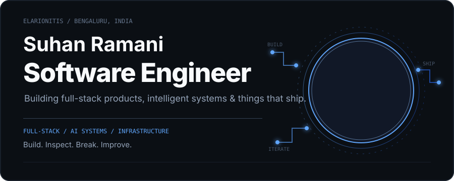
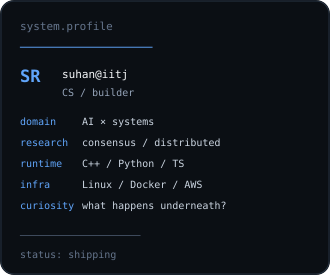
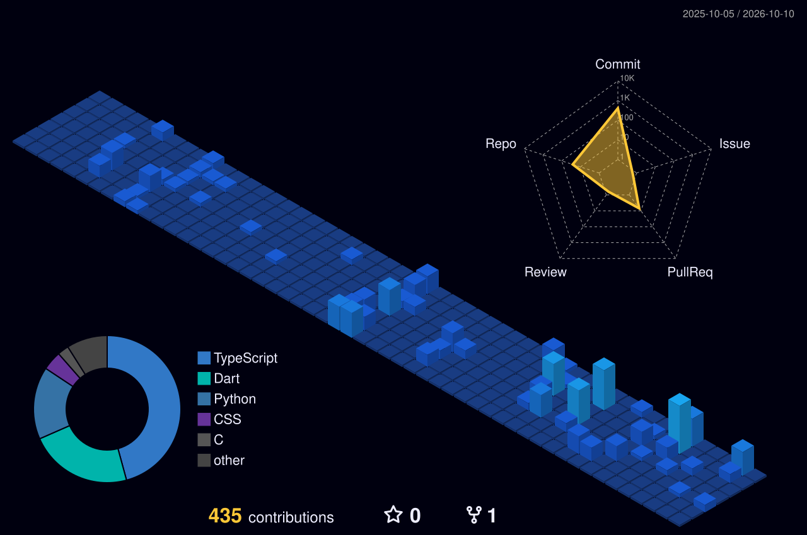

 

 

<table>
<tr>
<td width="62%" valign="top">

## I build software from the model down to the machine.

I'm a Computer Science student at **IIT Jodhpur**, interested in the boundary between **intelligent software and the systems that make it run**.

My work tends to fall into four connected areas:

`AI systems` · `distributed systems` · `backend engineering` · `core systems`

I like projects where the interesting part isn't just making the feature work, but understanding the machinery underneath it.

</td>

<td width="38%" valign="top">

</td>
</tr>
</table>

---

## Selected work

<table>
<tr>
<td width="50%" valign="top">

### 01 / SignEase

**Real-time sign language recognition**

Webcam landmarks → sequence model → sign prediction.

A full computer-vision inference pipeline built around temporal landmark sequences.

`TensorFlow` · `MediaPipe` · `FastAPI` · `Next.js`

**[source →](https://github.com/Elarionitis/SignEase)**

</td>

<td width="50%" valign="top">

### 02 / Orbit

**Concurrent TCP communication**

A multi-client communication system built around POSIX sockets, shared state and concurrent message broadcasting.

`C++` · `POSIX Sockets` · `Threads` · `CMake`

**[source →](https://github.com/Elarionitis/Orbit)**

</td>
</tr>

<tr>
<td width="50%" valign="top">

### 03 / Aeris

**Environmental intelligence**

Air-quality forecasting and explainable pollution insights combined with location-aware prioritization.

`Python` · `FastAPI` · `React` · `ML`

**[source →](https://github.com/Elarionitis/aeris)**

</td>

<td width="50%" valign="top">

### 04 / Spendly

**Group expense management**

Shared expenses, real-time balances and debt simplification in a mobile-first product.

`Flutter` · `Dart` · `Firebase`

**[source →](https://github.com/Elarionitis/Spendly)**

</td>
</tr>

<tr>
<td colspan="2" valign="top">

### 05 / SQORA

**Interactive AI learning**

Generated learning content, mock examinations and mathematical visualizations in one learning environment.

`React` · `Three.js` · `Gemini` · `Manim`

**[source →](https://github.com/Elarionitis/sqora)**

</td>
</tr>
</table>

---

## What I use

  
    
  
    
  

---

## Currently exploring

**Context-aware AI tooling**  
Making coding agents understand repositories, constraints and useful context.

**Distributed systems**  
Consensus, replication and fault tolerance without relying on a single authority.

**Low-level systems**  
Operating systems, network protocols and the path from a high-level API to the machine.

---

## GitHub activity

  

---

### Build. Inspect. Break. Improve.

Computer Science · IIT Jodhpur · AI/ML · Systems Engineering

